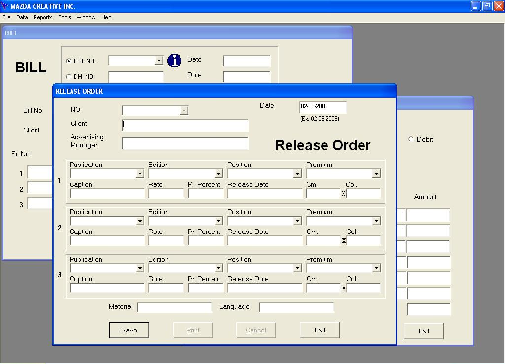



## Advertising Agency Software

### Description

This software is for an advertising agency and basically it allows creation and storage of release orders and bills for them. It also has some reports which can be used for accounting and management purposes. This software is already being used by an advertising agency in my city. I think it can be modified and used by any advertising agency and publishing house for their business management. However keep in mind that you may need to change many things if you are from outside india.

I have used VB6 for coding, Crystal Reports 8.5 for Reports, MS-Access 2000 for Database. Since its a complete application, I think coders who are beginning to program can learn many things from it.

Something which can be learned are:

1. How to use access database over LAN, so that many clients use data from single access database.

2. How to save simple application settings in registry.

3. How to do validations.

4. How to connect to access database using ADO.

5. How to layout database forms. Look how I have used same 4 buttons (new, update, delete, exit) on all the data forms.

6. How to create professoinal reports using crystal reports.

Feel free to add what else you have learned from this code and how have this code helped you, if it really does.

I will be waiting for your comments, though I don't promise replying everybody as this is an old code and I don't remember much of it, so if you ask how and why something is written, I may not be able to answer that. And usually I am pretty stuck up with various activities in my small software firm, so don't have much time to read and reply every mail. I hope you will understand.

Happy Coding!!
 
### More Info
 
Access 2000 is used as database. Crystal Reports 8.5 is used for Reports.

Database password is 26378

When run it will ask the location of database, please select the folder containing mazda.mdb file. This is a one time process.

You also need to enter master data like publications, editions and positions before software can become fully usable.

Publications may be names of news paper from you city.

Edition may name of editions, like different editions for different cities.

Positions may be positions for publishing ad like front page, back page etc.

You can also enter premium for a publication, like 200% premium for color ads.

Then you can enter rate card.

After this you can use the software fully. You can create and print release orders which you send to newspapers, you can print bills for clients. You can also save the bills which you get from the publishers.

Key Features: -

1.	Rate Card: - Store rates of all the Publications in database. Enable automatic entry of rates when you select Publication while making a Release Order

2.	Release Orders: - Enter Client Name, select a Publication from list, Rate will come automatically. Save, Print and Cancellation facility.

3.	Bills: - Select A RO No. (Release Order No.) and all the details will be automatically filled. Save, Print and Cancellation facility.

4.	LAN Compatibility: - Database can be kept on a server and all the clients can use the same database. RO and Bill can be created and printed from anywhere, anytime.

5.	Data Back Up and Restoring Facility: - Use Back Up option to store entered data in an external storage device and Use Restore option to bring back old data in case of system failure.

6.	Date Wise Sales Report:- Enter a From Date and To Date, to print Sales Report containing details of all the bills and sales tax amount for the selected period.

             |
---                |---
**Submitted On**   |2006-06-02 13:15:18
**By**             |[Palewar Techno Solutions](https://github.com/Planet-Source-Code/PSCIndex/blob/master/ByAuthor/palewar-techno-solutions.md)
**Level**          |Advanced
**User Rating**    |5.0 (10 globes from 2 users)
**Compatibility**  |VB 6\.0
**Category**       |[Complete Applications](https://github.com/Planet-Source-Code/PSCIndex/blob/master/ByCategory/complete-applications__1-27.md)
**World**          |[Visual Basic](https://github.com/Planet-Source-Code/PSCIndex/blob/master/ByWorld/visual-basic.md)
**Archive File**   |[Advertisin199812622006\.zip](https://github.com/Planet-Source-Code/palewar-techno-solutions-advertising-agency-software__1-65542/archive/master.zip)

